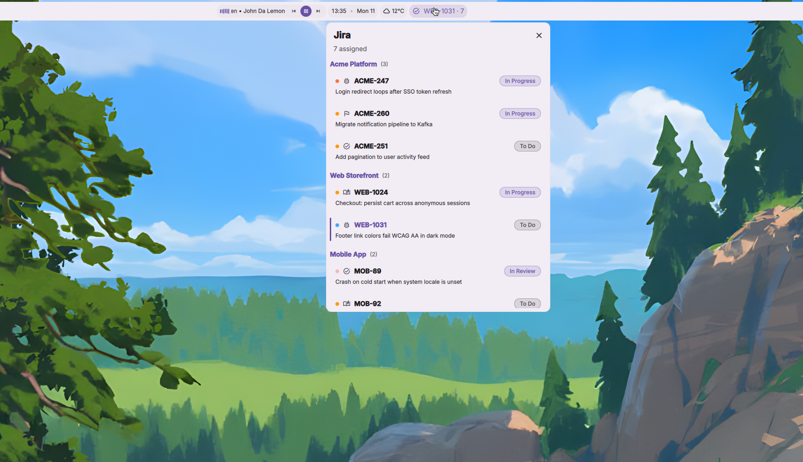

# Jira Tickets — a DankMaterialShell plugin

Your assigned Jira Cloud tickets, live on the DankBar — with one‑click open,
status transitions, comments, and copy‑branch‑name, all without leaving your
desktop.



```
plugin id:   dmsJira
type:        DankBar widget
license:     MIT
author:      Ivan Herrera Olivares
```

---

## Why you want this

You live in your shell. Your tickets live in a browser tab you keep losing.
This plugin closes that gap:

- **A pill that actually tells you something.** Icon + your active ticket key
  + how many are on your plate. Glanceable, no tab‑hunting.
- **"Active" does the right thing.** By default the pill follows your
  most‑recently‑updated ticket. Right‑click the pill to *pin* the one you're
  actually working on — the pin turns the pill accent‑colored and survives
  shell restarts.
- **The popout is a workbench, not a list.** Priority dot, issue‑type icon,
  status chip, two lines of summary. Optionally grouped by project.
- **Act in place.** Right‑click a row to expand an action bar:
  - **Open** in your browser
  - **Pin / Unpin** to the bar
  - **Copy key** (`ACME-247`)
  - **Copy branch** — a slugified branch name like
    `ACME-247-login-redirect-loops-after-sso-token`, optionally prefixed
    `feature/` · `bug/` · `chore/` from the issue type
  - **Status** — fetches the issue's real available transitions and applies
    the one you click
  - **Comment** — inline composer; plain text is converted to Jira's ADF
    (blank lines become paragraphs, single newlines become hard breaks, URLs
    auto‑link)
- **Instant on startup.** The last fetch is cached to plugin state, so the
  bar is populated the moment the shell starts — before the first poll even
  runs.
- **Bring your own JQL.** The default is "my open tickets, freshest first."
  Swap in any query you like.
- **Optional nudges.** Turn on desktop notifications for two things only —
  a ticket newly assigned to you, and a new comment that **@mentions you** on
  one of your open tickets. Both are off by default and intentionally narrow
  (no firehose of status-change noise).
- **Demo mode.** Flip one toggle to replace live data with fake‑but‑plausible
  tickets across three made‑up projects — perfect for screenshots, screen
  shares, or trying the UI before you wire up credentials.

---

## Requirements

- **DankMaterialShell** (the Quickshell‑based desktop shell). This is a DMS
  plugin; it has no use outside it.
- **A Jira Cloud site** and an **Atlassian API token** (free to create — see
  below). Jira Data Center / Server is not supported yet (see [Roadmap](#roadmap)).
- **`wl-clipboard`** — the *Copy key* / *Copy branch* actions shell out to
  `wl-copy` (Wayland).
- **`notify-send`** (from `libnotify`) — *only* if you enable notifications;
  alerts are delivered as standard libnotify messages, which DMS renders
  natively. Package: `libnotify-bin` on Debian/Ubuntu, `libnotify` on
  Arch / NixOS.
- **`secret-tool`** (from `libsecret`) — *optional, but recommended for
  secure token storage.* Needed only if you pick the libsecret token source,
  which keeps the API token in your encrypted keyring instead of a plaintext
  file. Also requires a running Secret Service provider (gnome‑keyring,
  KWallet with the libsecret bridge, etc.). Package: `libsecret-tools` on
  Debian/Ubuntu, `libsecret` on Arch / NixOS.

The plugin requests these DMS permissions: `network` (Jira REST calls),
`process` (run `wl-copy`, `notify-send`, `cat`, `secret-tool`), and
`settings_read` / `settings_write` (its own config).

---

## Install

DMS discovers plugins by scanning `~/.config/DankMaterialShell/plugins/` —
one directory per plugin.

### From the registry / a clone

```sh
git clone https://github.com/<owner>/dms-jira \
    ~/.config/DankMaterialShell/plugins/dms-jira
dms restart   # or just reload, below
```

Then open **DMS Settings → Plugins** and enable **Jira Tickets**. If it
doesn't appear yet:

```sh
dms ipc call plugins reload dmsJira
```

### For development (symlink + hot reload)

```sh
ln -s ~/code/dms-jira ~/.config/DankMaterialShell/plugins/dms-jira
dms ipc call plugins reload dmsJira   # re-run after edits — no shell restart
```

### Declaratively (Nix / home‑manager)

```nix
xdg.configFile."DankMaterialShell/plugins/dms-jira".source = ./dms-jira;
# use `recursive = true` if you vendor the directory — DMS writes plugin
# state at runtime, but to a separate path, so there's no read-only conflict.
```

---

## Get an Atlassian API token

1. Go to <https://id.atlassian.com/manage-profile/security/api-tokens>.
2. **Create API token**, give it a label (e.g. `dms-jira`), copy it.
3. Note the **email** shown top‑right on that page — that's the email the
   plugin authenticates with (Jira Cloud uses HTTP Basic with
   `email:api_token`, *not* your password).
4. Store the token where the plugin can read it — **a file** (simplest) or
   **libsecret** (encrypted at rest — recommended). Both are covered below.

> **Never** paste the token into the plugin's settings UI. It belongs in a
> file you control or your keyring — see [Security](#security).

### Option A — token in a file (default)

```sh
mkdir -p ~/.config/dms-jira
( umask 077; printf '%s\n' 'YOUR_API_TOKEN' > ~/.config/dms-jira/token )
# the file is created 0600; a trailing newline is fine — the plugin trims it
```

Point the **Token file path** setting at it (must be an absolute path).
`0600` permissions are strongly recommended.

> Note: this keeps the token in **plaintext on disk**, protected only by file
> permissions. For encryption at rest, use Option B.

### Option B — token in libsecret *(recommended; encrypted at rest)*

Requires the **`secret-tool` CLI** (from `libsecret`) and a running Secret
Service provider — gnome‑keyring, KWallet with the libsecret bridge, or
similar. See [Requirements](#requirements) for package names.

```sh
secret-tool store --label='dms-jira API token' \
    service dms-jira account you@example.com
```

`secret-tool` prompts for the token and the keyring stores it (encrypted).
Then set **Token source** to *libsecret* in the plugin settings. The plugin looks it
up with `secret-tool lookup service dms-jira account you@example.com`, keyed
on the email you configured.

> **Rotating the token?** After changing the file contents or the keyring
> entry, reload the plugin so it re‑reads:
> `dms ipc call plugins reload dmsJira`.

---

## Configure

**DMS Settings → Plugins → Jira Tickets:**

| Setting | What it does |
|---|---|
| **Site URL** | `https://your-org.atlassian.net` — must be `https://`; the plugin refuses to send credentials over anything else. |
| **Email** | The email on your Atlassian account. |
| **Token source** | `File` (default) or `libsecret`. |
| **Token file path** | Absolute path to the `0600` file holding your API token. Shown only when token source is `File`. |
| **JQL** | The query for "my tickets." Default: `assignee = currentUser() AND statusCategory != Done ORDER BY updated DESC`. Up to 50 issues are shown. |
| **Poll interval** | 1 / 2 / 5 / 10 / 15 / 30 / 60 minutes (default 5). Saving connection/JQL settings also triggers an immediate refresh. |
| **Show active ticket key on bar** | On: pill shows `KEY · count`. Off: just the count. |
| **Prefix branch name with issue type** | Adds `feature/` · `bug/` · `chore/` (derived from `issuetype`) when copying branch names. |
| **Group by project** | Groups the popout list under per‑project headers. |
| **New assignment** notification | Off by default. When on, sends a desktop notification when a ticket appears in your list that wasn't there on the previous poll. Needs `notify-send`. |
| **@mentions** notification | Off by default. When on, after each poll the plugin checks recent comments on your open tickets and notifies you about any new one whose body @mentions you. Costs one extra API request per open ticket; needs `notify-send`. |
| **Demo mode** | Replaces live tickets with fake data and skips the Jira API entirely. Safe for screenshots. |

> The first poll after install only *seeds* state — it never fires
> notifications, so you don't get alerted about every ticket and comment that
> already exists. Alerts start from the next poll onward.

### Using the widget

- **Click the pill** → open the popout.
- **Right‑click the pill** → pin the shown ticket to the bar / unpin.
- **Click a row** → open that ticket in your browser.
- **Right‑click a row** → expand its action bar (Open · Pin · Copy key ·
  Copy branch · Status · Comment). Right‑click again to collapse.

---

## Security

- **The API token is never written to plugin settings.** You hand the plugin
  a *path* (or a keyring lookup), not the secret itself. Keep the token file
  at mode `0600`.
- **HTTPS is enforced.** Non‑`https://` site URLs are rejected before any
  request goes out; the *Open* action likewise refuses to launch a
  non‑`https://` URL.
- **Issue keys are validated** (`PROJECT-123` shape) before they're ever
  interpolated into a URL path or handed to the browser, and the email is
  rejected if it contains control characters.
- **Cached ticket summaries are persisted unencrypted** as DMS plugin state
  (`~/.local/state/DankMaterialShell/dmsJira_state.json`) so the bar can
  paint on shell start before the first poll. If your ticket *titles* are
  sensitive at the filesystem‑trust boundary, be aware of that file (and
  consider Demo mode, or clearing it).
- The clipboard write uses `wl-copy -- <text>` so the copied value can't be
  misread as a flag.

---

## Troubleshooting

| Symptom | Likely fix |
|---|---|
| Popout says **"Not configured"** / **"Open Settings → Plugins…"** | Set **Site URL** and **Email**. |
| `HTTP 401` in the popout error line | Wrong email or token. Use the *API token*, not your account password, and the email shown on the Atlassian token page. |
| `HTTP 400` after editing JQL | The JQL is invalid — paste it into Jira's issue search to see the parser error. |
| **List is empty, no error** | Your JQL matched nothing. Turn on **Demo mode** to confirm the UI works, then refine the query. |
| `token file is empty or unreadable: …` | The path must be **absolute** and readable by your user; the file must be non‑empty. |
| `no token in keyring for this email …` | Run the `secret-tool store … service dms-jira account <email>` command, with the same email you configured. |
| *Copy key* / *Copy branch* do nothing | Install `wl-clipboard` (provides `wl-copy`). |
| Notifications never appear | Install `libnotify` (provides `notify-send`), confirm a notification daemon is running, and remember the first poll after install is silent by design. |
| Widget doesn't show after cloning | `dms ipc call plugins reload dmsJira`, or restart the shell, then enable it in Settings → Plugins. |

The plugin uses Jira Cloud's `/rest/api/3/search/jql` endpoint (the
token‑paginated successor to the legacy `/search`).

---

## Roadmap

- **Richer notification rules** — per-project filters, quiet hours, and
  optionally folding multiple new assignments into one summary alert.
- **Light markdown in comments** — bold / italic / `code` / lists, via the
  in‑tree ADF builder (no external dependency).
- **Jira Data Center / Server** — `JiraClient.qml` already isolates every
  endpoint; the remaining work is the auth header, `/rest/api/2` vs `/3`,
  and wiki‑markup vs ADF comment bodies, behind a `flavor` setting.
- **Multi‑site** — the settings schema already treats the site as a list of
  one, so this is additive.

---

## Project layout

```
dms-jira/
├── plugin.json          # manifest (id, permissions, entry points)
├── DmsJira.qml          # PluginComponent — bar pill, popout, row actions
├── DmsJiraSettings.qml  # PluginSettings — the config UI above
├── JiraClient.qml       # Jira REST v3 wrapper (search, transitions, comments, /myself)
├── AdfBuilder.js        # plain text → Atlassian Document Format
├── assets/
│   └── screenshot.png
├── DESIGN.md            # design notes & decisions
└── LICENSE              # MIT
```

## License

MIT — see [LICENSE](LICENSE). Built for
[DankMaterialShell](https://github.com/AvengeMedia/DankMaterialShell);
talks to [Jira Cloud REST v3](https://developer.atlassian.com/cloud/jira/platform/rest/v3/).
